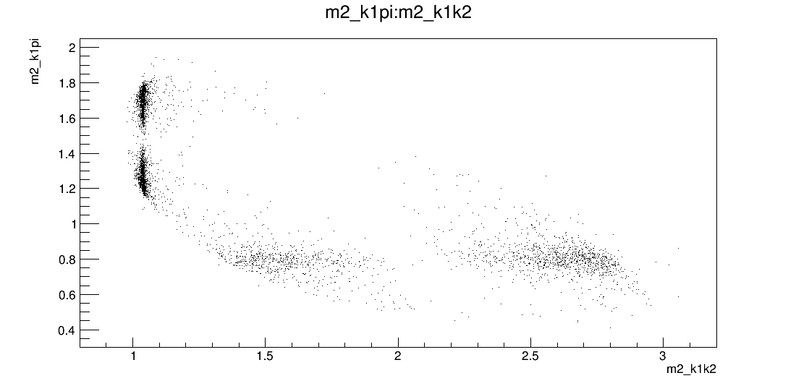

# Dalitz_analysis

This project chose Dalitz method and maximum likelihood to fit the data form BES III with ROOT software, based C++, and calculated the decay fraction ratio.

## 1. Background

* ROOT

  This is a C++ software from Cern, which is used for data analysis, calculation and data visualization.

  

* Dalitz

  Dalitz is a method for analyzing the three body decay process. Dalitz plot can indicate the feature of the decay, shown below.

## 2. Code files

* create.C

  This file is to load the three body decay data.

* fcn.C

  This file is to build the Fermi Gold Law Formula, in order to build the 2D Dalitz plot's probability distribution function(PDF). 

* fraction.C

  This is to calculate the two decay channels' fractional ratio.

* graph.C

  This is the decay data visualization.

* nll.C

  This is to build the likelihood probability.

* main.C

  Use the optimizer of ROOT to fit the parameters of Fermi Gold Law Formula and calculate the fractional ratio.

* plot.C

  Use Monte Carlo simulation to reconstruct the decay data and plot data with the calculated parameters.

## 3. Method

1. We construct the 2D dalitz plot's PDF using Fermi Gold Law Formula.
2. Load data and build the maximum likelihood probability using the PDF.
3. Using the optimizer of ROOT to fit the parameters of PDF and reconstruct the Fermi Gold Law Formula.
4. Using the calculated parameters, we reconstruct the three body decay model and reproduce the decay data to check it directly.

